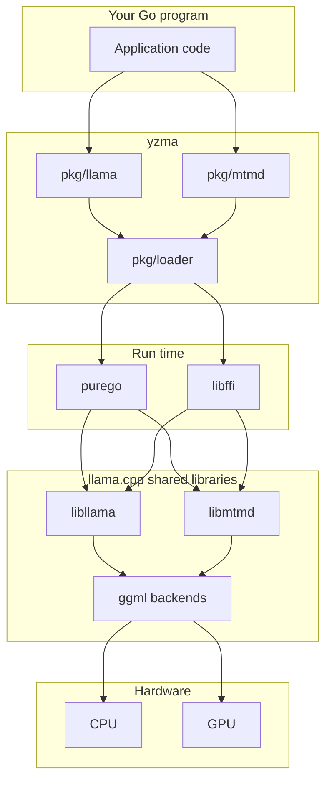

## Overview

yzma calls `llama.cpp` in the same process as your Go program. There is no model server and there is no network connection.



## No CGo

Most Go bindings for a C library use CGo. CGo needs a C compiler, and it makes cross compilation hard.

yzma uses [purego](https://github.com/ebitengine/purego) and [ffi](https://github.com/JupiterRider/ffi) instead. These packages open a shared library at run time and call a function in it. The result is that:

- You build your program with the normal `go build` and `go run` commands.
- You do not need a C compiler.
- You cross compile with the normal `GOOS` and `GOARCH` variables.
- You can replace the `llama.cpp` libraries without a new build of your Go program, while `llama.cpp` makes no breaking change.

## Load at run time

`llama.Load` opens the shared libraries. It takes the directory that holds them. Most programs read that directory from the `YZMA_LIB` environment variable.

```go
llama.Load(os.Getenv("YZMA_LIB"))
llama.Init()
```

`Load` prepares each function call one time. `pkg/loader` holds this code.

## The generation loop

The loop stays in your Go code. yzma does not hide it.

1. `Tokenize` turns text into tokens.
2. `BatchGetOne` puts the tokens in a batch.
3. `Decode` runs the model on the batch.
4. `SamplerSample` takes the next token from the sampler chain.
5. `TokenToPiece` turns the token back into text.
6. The loop repeats with the new token, until the model gives an end of generation token.

Because the loop is yours, you decide when to stop, what to print, and what to do with each token.

## In a browser

A WebAssembly module has no `dlopen` and no libffi, so the design changes in a browser. `llama.cpp` becomes a second WebAssembly module, and the Go code calls it through JavaScript. See [WebAssembly](/docs/concepts/webassembly/).
