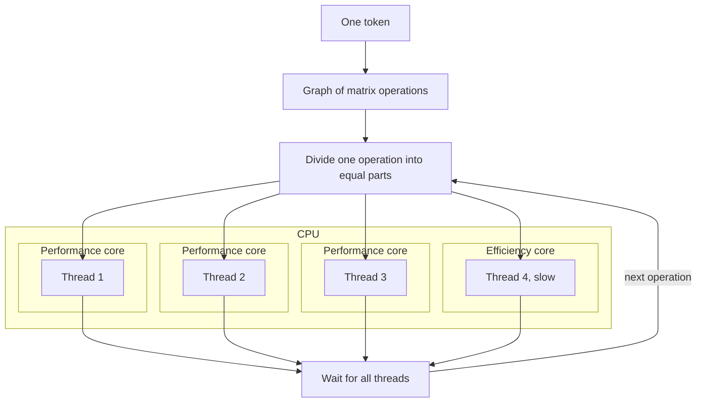
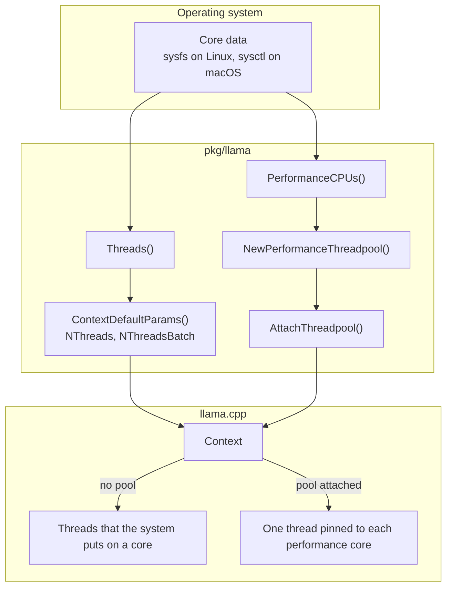

High performance inference requires that we use multiple threads when executing on a multicore processor. `llama.cpp` has functions to calculate how many threads to use per model. yzma then uses this information to set how many threads it uses, and on which cores they run.

## How llama.cpp uses processor cores

Each token is a graph of many matrix operations. `llama.cpp` divides each operation into equal parts, one for each thread. All threads must finish an operation before the next operation starts. So the slowest thread sets the speed.



Two conditions make a thread slow:

- The thread is on an efficiency core.
- Two threads share one physical core. The two CPUs of one core share the same arithmetic units.

Too few threads also make inference slow, because cores stay idle. So the best number is one thread for each physical performance core.

## How yzma uses threads



## The default number of threads

By default `llama.cpp` requests four threads. This is slow on a machine with many cores. yzma calculates a more efficient number based on the available system resources.

`llama.Threads()` returns one thread for each core that does the arithmetic well. That is one thread for each physical core. On a machine with performance cores and efficiency cores, it counts only the performance cores.

| System | How yzma counts the cores |
| --- | --- |
| Linux | It reads sysfs. `/sys/devices/cpu_core/cpus` gives the performance cores, and `thread_siblings_list` removes the second CPU of each core. |
| macOS | It reads `hw.perflevel0.physicalcpu`, which is the number of performance cores on Apple Silicon. An Intel Mac gives `hw.physicalcpu`. |
| Other systems | Half of the logical CPUs. A machine with four logical CPUs or fewer gets all of them. |

On Linux and macOS, yzma also uses half of the logical CPUs when the system does not return a specific value.

These calls use `llama.Threads()`:

- `llama.ContextDefaultParams()` sets `NThreads` and `NThreadsBatch`.
- `mtmd.ContextParamsDefault()` sets `Threads`.

## Changing the number of threads

If you want to change the number of threads used, set these two values before creating the context.

```go
params := llama.ContextDefaultParams()
params.NThreads = 8
params.NThreadsBatch = 8

ctx, err := llama.InitFromModel(model, params)
```

`NThreads` controls the generation per token. `NThreadsBatch` controls the prompt, and is used for batches with multiple tokens.

To change these values after you have created the context, use `llama.SetNThreads(ctx, nThreads, nThreadsBatch)`. The functions `llama.NThreads(ctx)` and `llama.NThreadsBatch(ctx)` return the current values for an existing context.

For a multimodal model, set `Threads` in the parameters of `mtmd` as well.

The native examples have a `-t` flag. The value 0 gives the default.

## Pin each thread to a core

The operating system can move a thread from one core to a different core. On a machine with two kinds of cores, it can put a thread on an efficiency core. If this happens, that thread will be slow for inference. A thread pool with a CPU mask prevents this.

`llama.NewPerformanceThreadpool()` creates a pool with one thread for each performance core. Each thread stays on a CPU of its own.

```go
mparams := llama.ModelDefaultParams()
mparams.SetCPUOnly()

model, err := llama.ModelLoadFromFile(modelFile, mparams)
if err != nil {
	return err
}

ctx, err := llama.InitFromModel(model, llama.ContextDefaultParams())
if err != nil {
	return err
}

tp, err := llama.NewPerformanceThreadpool()
if err == nil {
	llama.AttachThreadpool(ctx, uintptr(tp), uintptr(tp))
}

// Use the context.

llama.DetachThreadpool(ctx)
llama.Free(ctx)
llama.ThreadpoolFree(tp)
```

Follow these rules:

- Call `llama.Init()` before you create a pool. The CPU backend supplies the pool calls, and they exist only after the backend starts.
- Use `ModelParams.SetCPUOnly()` for the model. Do not set the CPU in a device list with `SetDevices`. Using a device list makes `llama.cpp` start a second CPU backend, and the pool then gets no work.
- Detach the pool from each context before you free the pool.

The call can return two errors.

| Error | Meaning |
| --- | --- |
| `llama.ErrNoPerformanceCPUs` | The system cannot tell which CPUs to use. |
| `llama.ErrNoThreadpool` | This build of `llama.cpp` cannot create pools. |

Only Linux returns info for the CPUs. macOS does not let a thread select a CPU, and on the other systems yzma cannot read the cores. On those systems, just use the default threads.

### Create your own thread pool

To select the CPUs yourself, set the parameters and then create the pool.

```go
params := llama.ThreadpoolParamsDefault(4)
params.SetCPUs([]int32{0, 2, 4, 6})
params.Prio = llama.SchedPriorityHigh

tp, err := llama.ThreadpoolNew(&params)
```

`SetCPUs` sets the CPUs in the mask and calls `StrictCPU`, which gives each thread one CPU. `llama.PerformanceCPUs()` returns the list that `NewPerformanceThreadpool` uses.

## Goroutines

The `mtmd` package knows which calls are safe to use from more than one goroutine.

| Call | Safe from multiple goroutines |
| --- | --- |
| `mtmd.Tokenize` | Yes, with a shared context. |
| `mtmd.Encode`, `mtmd.EncodeChunk` | No. |
| `mtmd.HelperEvalChunks` | yzma lets only one call run at a time, for all contexts. |

## In the browser

There are three builds of `llama.cpp` for WebAssembly. The loader selects one of them.

| Build | Threads |
| --- | --- |
| WebGPU | 1. The GPU does the work. |
| CPU with multithreading | The logical CPUs of the machine, from 1 to 16. |
| CPU with single threading | 1. |

The multithreaded build needs `SharedArrayBuffer`. The browser passes it only to a page that has the `Cross-Origin-Opener-Policy` header and the `Cross-Origin-Embedder-Policy` header. Without them, the loader selects the single threaded build.

These `llamawasm` calls tell you what the loader selected.

- `Threaded()` tells if the module uses multithreading.
- `Threads()` returns the number of threads. `ContextDefaultParams` and `MtmdContextParamsDefault` set this value.
- `Backend()` returns `webgpu`, `cpu-threads`, or `cpu`.

`llamawasm.SetNThreads` changes the thread count of a context after you create it.

Only one goroutine can call into the module at a time, because the package keeps scratch memory in the module. Each call is synchronous, so put the code in a Web Worker and not on the main thread. For more, see the [browser guide](/docs/guides/browser/).

## See the result on your machine

The [`systeminfo`](https://github.com/hybridgroup/yzma/tree/main/examples/systeminfo) example shows the logical CPUs, the number from `llama.Threads()`, the performance CPUs, and if a thread pool is possible.
