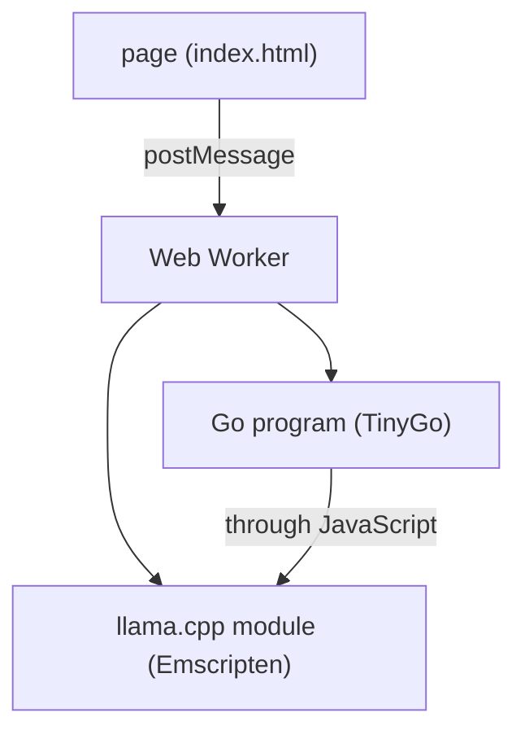

yzma runs in a browser. The model stays on the machine of the reader, and no server does the work.

## Two modules

There are two WebAssembly modules in the page.



On a native platform yzma calls `llama.cpp` with libffi and opens the shared libraries at run time. A WebAssembly module has no `dlopen` and no libffi, and TinyGo cannot compile the C++ of `llama.cpp`.

Thus `llama.cpp` becomes a second WebAssembly module. Emscripten builds it with a small C shim, and the Go code calls that module through JavaScript. The shim is in the `wasm` directory of the [llama-cpp-builder](https://github.com/hybridgroup/llama-cpp-builder) repository.

The generation loop stays in Go. It does one `Decode` and one `SamplerSample` for each token, the same as a native program.

## Three builds

The JavaScript glue selects the best build that the browser can run.

| Build | What the browser must have |
| --- | --- |
| WebGPU | WebGPU with f16 shaders, and JSPI. Chrome or Edge 137 and later, or Firefox 153 and later with two settings in `about:config`. |
| More threads | `SharedArrayBuffer`, so the page must send the COOP header and the COEP header. |
| One thread | Nothing. It works in every browser. |

A browser with no WebGPU still works. It runs on the CPU.

The page prints which build it got:

```
backend: webgpu (WebGPU)
```

The GPU is worth the most to a page that takes images. An image through the projector of a model takes a second or two on the GPU, against half a minute or more on the CPU.

## Why a Web Worker

The generation loop takes a long time. It would stop the page if it ran on the main thread. The worker keeps the page able to draw and to accept a click.

The worker sends each piece of text to the page with `postMessage`, so the page shows the answer while the model makes it.

## The files

| File | What it does |
| --- | --- |
| `yzma-loader.js` | Finds the best build that the browser can run and loads it. |
| `worker.js` | Runs `llama.cpp` and the Go program in a Web Worker. |
| `index.html` | A page that loads a model and makes text. |
| `vlm.html` | A page that asks a question about an image. |
| `tools.html` | A page where the model calls tools. |
| `serve/main.go` | A static server that sends the COOP header and the COEP header. |

## The API

A browser program uses [`pkg/llamawasm`](https://pkg.go.dev/github.com/hybridgroup/yzma/pkg/llamawasm). It has the calls that text generation, embeddings, and images need. The names and the order of the calls are the same as in `pkg/llama` and `pkg/mtmd`, so a program moves from one to the other with a change of the import.

## Limits

The browser package has no audio, no video, no LoRA adapters, no saved state, and no quantization.

The model file must come down to the browser before the first token. A 2 GB model is a 2 GB download.

## Next steps

- [Try it in your browser](/try/)
- [Install the WebAssembly build](/getting-started/install/browser/)
- [Run yzma in a browser](/docs/tutorials/browser/)
- [Build for a browser](/docs/guides/browser/)
